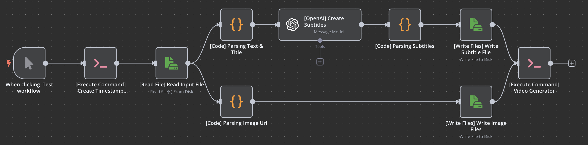

# YouTube Shorts 자동 생성 파이프라인

뉴스 기사 → AI 자막 생성 → 슬라이드 영상 → YouTube 자동 업로드

## 아키텍처

```
[Input JSON] → [n8n Workflow] → [ffmpeg 영상 생성] → [Python Watchdog] → [YouTube 업로드]
```

## 서비스 구성

| 서비스 | 이미지 | 역할 |
|--------|--------|------|
| n8n | n8nio/n8n:1.70.3 + ffmpeg | 워크플로우 실행 (이미지 다운로드, AI 자막 생성, 영상 생성) |
| python | python:3.12-slim | `/app/videos/` 감시 → YouTube 자동 업로드 |

## n8n 워크플로우


- 이미지 슬라이드 + 한글 자막 → `shorts.mp4` 생성
- 파일 저장 경로: `/app/{images|scripts|videos}/{yyyyMMdd-HH}/` (KST 기준)
- web에서 workflow 수정 시에 workflow.json 최신화 필요

## 공유 볼륨

| 볼륨 | 용도        | 사용 서비스 |
|------|-----------|------------|
| `videos` | 영상 파일 저장  | n8n, python |
| `images` | 이미지 파일 저장 | n8n |
| `scripts` | 자막 파일 저장  | n8n |
| `n8n_data` | n8n 설정    | n8n |

## 실행

```bash
docker compose up -d --build
```

- n8n: http://localhost:5678
- OpenAI credential은 n8n 웹에서 수동 등록 필요

## 프로젝트 구조

```
junhaalee/
├── docker-compose.yml              # n8n(영상 생성) + python(영상 업로드)
├── n8n/
│   ├── Dockerfile
│   ├── input.json                  # 테스트 데이터
│   ├── script/
│   │   └── entrypoint.sh           # 워크플로우 import + n8n 실행
│   ├── resources/
│   │   └── api-key.txt             # OpenAI API KEY
│   └── workflow/
│       └── workflow.json           # n8n 워크플로우 정의
└── python/
    ├── Dockerfile
    ├── main.py                     # YouTube 업로드 + watchdog
    ├── requirements.txt
    ├── util/
    │   ├── __init__.py
    │   └── WatchdogUtil.py         # 파일 감시
    └── resources/
        ├── client_secret.json      # Google OAuth2 클라이언트
        └── token.json              # OAuth2 토큰
```

## 입력 형식 (input.json)

```json
{
  "image": ["https://example.com/img1.jpg", "https://example.com/img2.jpg"],
  "title": "기사 제목",
  "text": "기사 본문..."
}
```
